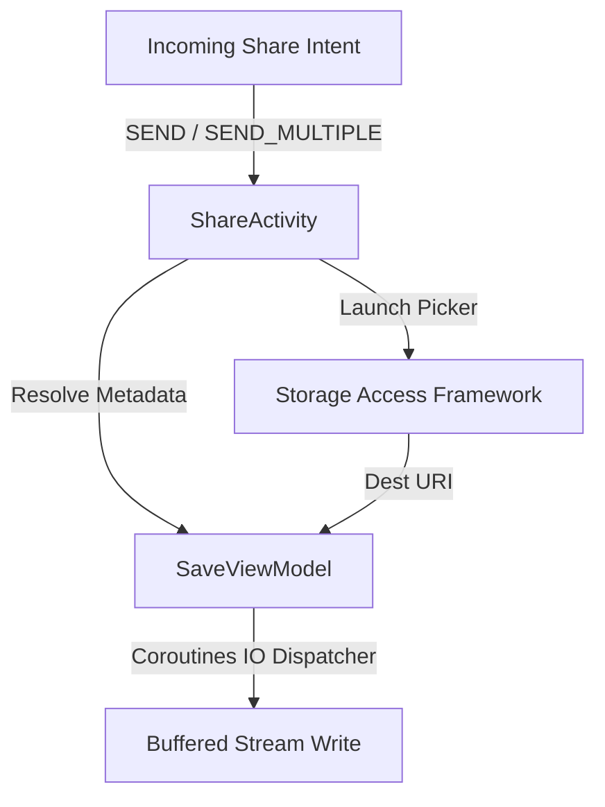

# SaveTo

[](https://github.com/sudo-py-dev/SaveTo/actions/workflows/ci.yml)
[](https://github.com/sudo-py-dev/SaveTo/releases)
[](LICENSE)
[](https://android-arsenal.com/api?level=21)

SaveTo is a lightweight, single-purpose Android utility that integrates into the system-wide sharing sheet to save shared files, multiple documents, or text directly to any destination chosen via the Storage Access Framework (SAF).

---

## Key Features

- **Seamless Share Target**: Integrates directly with Android's system share sheet, registering for `android.intent.action.SEND` and `android.intent.action.SEND_MULTIPLE` across all MIME types (`*/*`).
- **No Launcher Clutter**: The application does not declare a launcher activity, keeping the launcher interface clean. It is active only when files are shared.
- **Privacy & Security First**: Zero dangerous storage permissions (such as `READ_EXTERNAL_STORAGE` or `WRITE_EXTERNAL_STORAGE`) are required. It relies entirely on temporary URI permissions granted dynamically via incoming Intents.
- **Bulk Save support**: When multiple files are shared, it lets you select a destination directory and saves all files in one operation with a progress tracking indicator.
- **Text-to-File Conversion**: Automatically detects shared text content, converts it into a `.txt` file, and prompts to save it.
- **Robust Error Handling**: Safely reports partial failures when bulk-saving multiple files, handles I/O exceptions, and cleans up temporary cache files.

---

## Technical Architecture

The codebase is structured following clean Android architecture principles, utilizing Kotlin, Coroutines, and Android Jetpack Architecture Components.



### Components

- **[AndroidManifest.xml](app/src/main/AndroidManifest.xml)**: Configures the intent filters, theme settings, and application metadata. `ShareActivity` is configured with a translucent theme (`Theme.Translucent.NoTitleBar`) so that it overlays seamlessly onto the system share dialog.
- **[ShareActivity.kt](app/src/main/kotlin/com/save/to/ShareActivity.kt)**: Manages UI, checks URI read access, interacts with the Android Storage Access Framework (using `ActivityResultContracts.CreateDocument` and `OpenDocumentTree`), and shows standard system alerts and progress dialogs.
- **[SaveViewModel.kt](app/src/main/kotlin/com/save/to/SaveViewModel.kt)**: Houses the business logic for resolving source file details, performing high-performance I/O operations using a buffered stream (`8KB` buffer size), managing state, and cleaning up cache files.
- **[strings.xml](app/src/main/res/values/strings.xml)**: Declares all UI string resources and error messages for user-facing localization.

---

## Development & Build Requirements

- **SDK Targets**: Min SDK `21` (Android 5.0), Target SDK `34` (Android 14)
- **Java Compatibility**: JDK `17` toolchain
- **Build Tool**: Gradle Kotlin DSL

### Code Styling and Design

This application strictly follows modern development standards:
- **Coroutines for Asynchronous I/O**: Offloads stream writing tasks to `Dispatchers.IO` and uses `ensureActive()` inside loops to respect lifecycle cancellation.
- **No Force Unwraps**: Handles null values gracefully and relies on defensive typing contracts to prevent runtime crashes.
- **Resource Cleanup**: Employs `use { ... }` blocks for Kotlin `Closeable` objects, ensuring input and output streams are safely closed under all circumstances.

### Building the Project

Ensure you have a valid `keystore.properties` file configured in the root directory prior to building. Run the following command from the project root to compile a release build:

```bash
./gradlew assembleRelease
```

---

## GitHub Actions & Automated Releases

This project utilizes GitHub Actions for continuous integration and automated releases. 

### Continuous Integration (CI)
On every push and pull request to the `main` branch, the [Android CI workflow](.github/workflows/ci.yml) executes:
1. Runs all unit tests.
2. Compiles a debug build to ensure codebase integrity.

### Automated Releases (Current version: `v1.1`)
When a version tag is pushed (e.g., `v1.1`), the [Publish Android Release workflow](.github/workflows/release.yml) is triggered. It builds, signs, and attaches both Google Play and FOSS release APKs and App Bundles (`.apk` and `.aab`) to a newly drafted/published GitHub Release.
